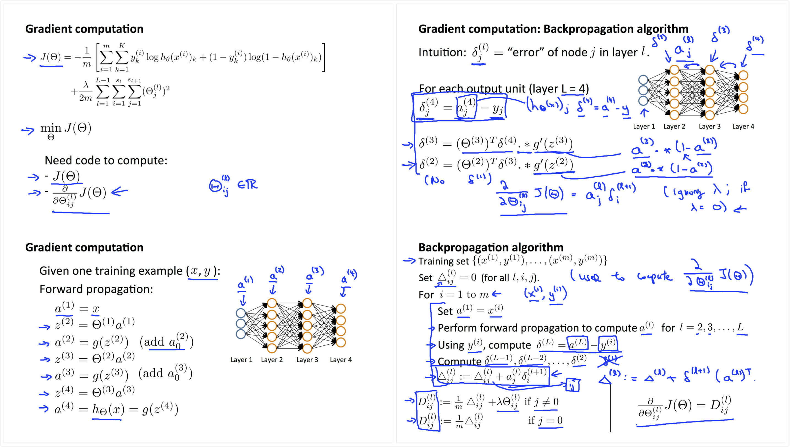
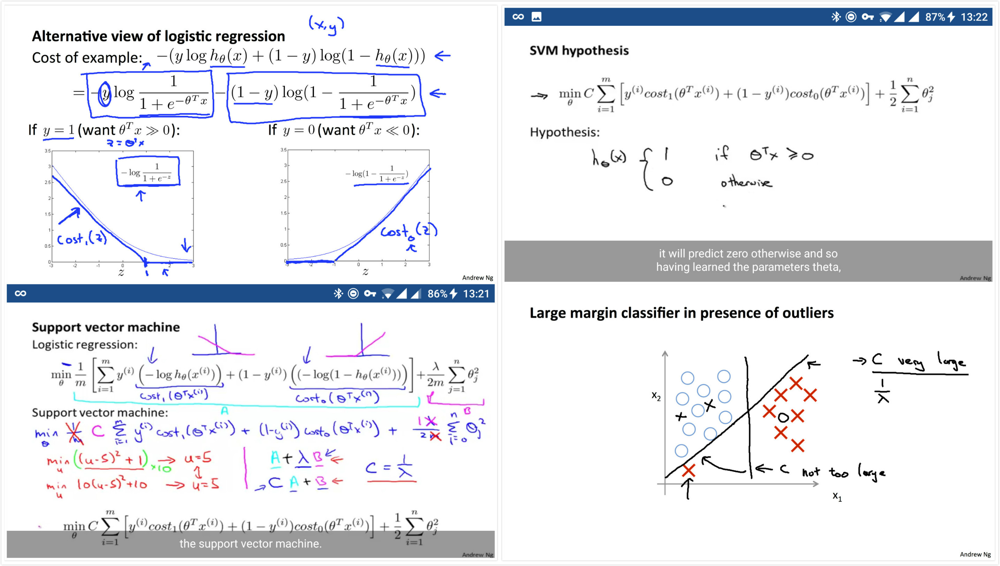
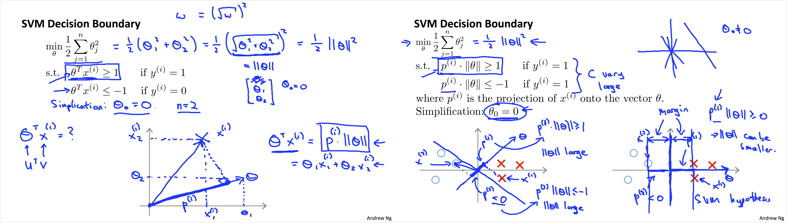
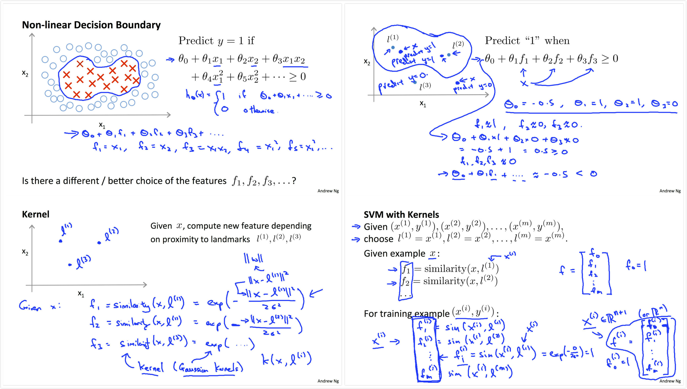
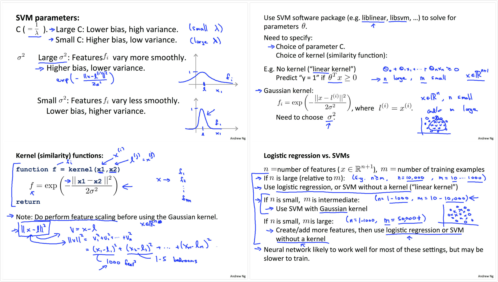
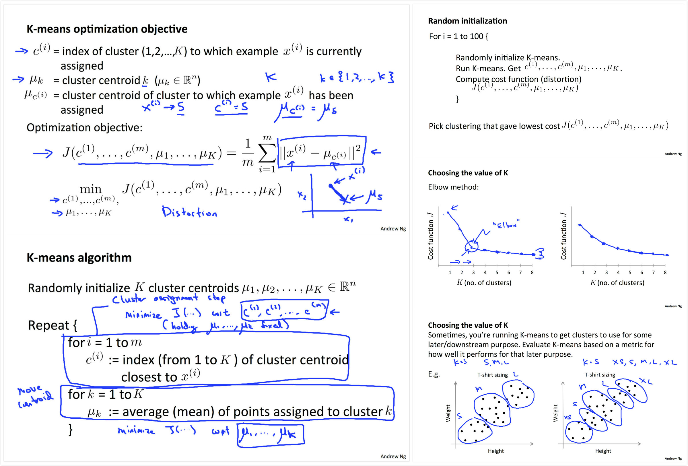
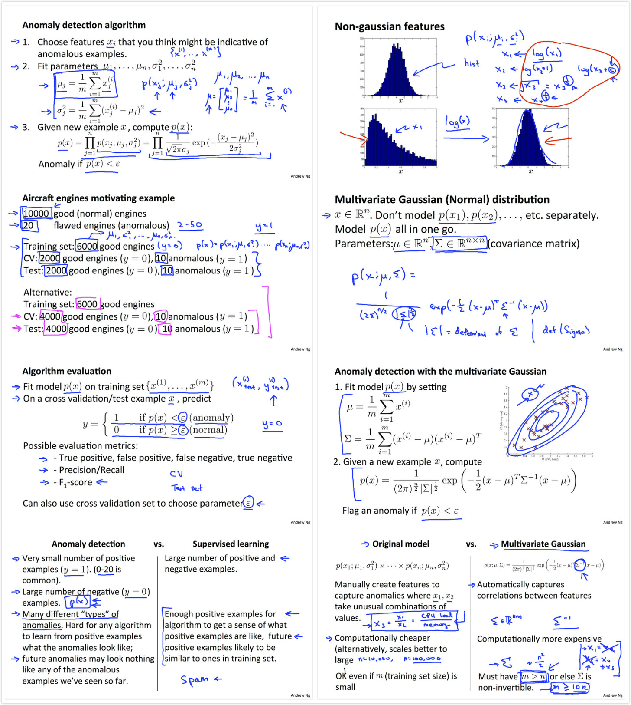

<script type="text/javascript" src="http://cdn.mathjax.org/mathjax/latest/MathJax.js?config=default"></script>


# Machine Learning Summary 


[TOC]


本篇总结一下Coursera的两个Machine Learning课程，方便以后回来看看。 

- Machine Learning Specialization - Washington University. 
  https://www.coursera.org/specializations/machine-learning
  这个specialization讲的挺细，做了不少可视化，遗憾的是最后两门取消了。  
- Machine Learning - Stanford University
  https://www.coursera.org/learn/machine-learning/
  毕竟是Andrew Ng的课, 两门课有重复的地方也有不一样的地方，有时间都看了也还是不错的。  

# Course Structure

## Machine Learning Specialization

## Machine Learning

- ex1 Linear Regression (Lecture2,4)     3 Linear Algbra Review 5 Octave Tutorial)
- ex2 Logistic Regression (Lecture6,7 )
- ex3 Multi-class Classification and Neural Networks (Lecture8)
- ex4 Neural Networks Learning (Lecture9)
- ex5 Regularized Linear Regression and Bias v.s. Variance
- ex6 Support Vector Machines (Lecture12)
- ex7 K-means (Lecture13)
- Dimension Reduction (Lecture14)
- Anormaly Detction (Lecture15)
- Recommender System(Lecture16)
- Large Scale Machine Learning (Lecture17)
- Photo OCR (Lecture18)

# Regression

Regrassion predict连续的输出。 

## Linear Regression

叫做linear regression, 但是feature可以是非线性的，output y是feature们的线性组合。 

### Model representation 

> \\(y_{m\*1} = X_{m\*n} \* \theta_{n\*1} \\)

In matlab code:

```matlab
y = X*theta
```

- feature X, Size m*n, m is the number of data points, n is the number of feature.  
- label y, Size m*1, label of m data points. 
- weights theta, Size n*1, 

Regression就是在已知数据集feature矩阵(X)和数据label(y)的情况下估计feature的weights(theta). 即已知X,y,求解最fit数据集的theta。有了theta, 就能对数据集中的training example，如X(i,:), 做出估计的label值y, 估计的y也常表示为\\( \hat{y}\\). 

### Objective/Cost function 

模型建立好了，求解theta则是个优化问题。定义Objective/Cost function(目标函数), 求使Cost function值最小的theta. 

``` matlab 
predictions = X*theta;
J = (1/2)*mean((y-predictions).^2);
```

### Solve the Equation 

Linear regression 的objective function是个凸函数, 不存在除global minimum以外的极值。

#### Normal Equation 

```
theta = (X'*X)^-1*X'*y
```

- No need to choose a(learning rate)
- No need iterate
- Need to compute `(X'*X)^-1`
- Slow if n is very large 

适合在数据集不大的n<=10000的情况下使用。

**if `(X'*X)^-1` is non-invertible(singular/degenerate), it is possible that:**

- Redundant features(linearly dependent)
- Too many features (m < n)  

在这种情况下Octave/Matlab可以用pinv函数，基本上是ok的。

#### Gradient Descent 

```
gradient =  (1/m)*(X'*(X*theta-y));
theta = theta - alpha*gradient;
```

Compute the gradient(导数) of cost function, tune learning rate(alpha) to find an optimal theta.

#### Note 

- **Batch gradient descent:** each step of gradient descent uses all the training examples.
- **Mini batch gradient descent:** mini batch size for one step(good for parallel computing implementation).
- **Stochastic gradient descent:** one random training example for one step.  

#### More advanced optimization 

事实上很多优化的算法已经有现成的函数了, 那么given theta, we can compute:

- Cost: J_theta (a real number)
- Gradient of J_theta by theta: gradient (a n*1 vector)

Optimization algorithms:

- Gradient descent
- Conjugate gradient
- BFGS
- L-BFGS (Limited-memory Broyden Fletcher Goldfsrb Shanno Method)

在《数学之美》中提到，BFGS的收敛比较快，与随机梯度法相似，但是要略微复杂一些，它可以根据目标的‘远近’调整迭代的步长，然后L-BFGS的方法更容易并行化实现。是Google大脑采用的算法。

Advantages:

- No need to manually pick learning rate(alpha).
- Often faster than gradient descent.

Disadvantages:  

- more complex

In matlab, write a function to compute cost and gradient:
```matlab
function [jVal, gradient] = costFunction(theta)
jVal = ...
gradient = ...
```

call a optimization function to get optimal theta:
```matlab
options =  optimset(‘GradObj’, ‘on’, ‘MaxIter’, ‘100’);
initialTheta = zeros(n, 1);
[optTheta, cost, exitFlag] = fminunc(@(t)(costFunction(t, X, y)), initial_theta, options);
```

#### Dealing with over fitting

##### Ridge regression

##### Lasso Regression


##### Regularized linear regression and logistic regression
(在Ng的课中只用到了l2-norm)


# Classification 

## Logistic regression 

将linear regression的output(y)通过sigmoid映射到(0, 1), 假设这是预测为1的概率(probability), 设上一个概率threshold(decision boundary)就能根据输出进行分类了。将该输出看作概率，那么logistic regression的Quality metric就是以Maximizing likelihood(probability of data)为目标来定义的了。即找出theta,使data(X)预测出label(y)的概率最大化。于是logistic regression model就能用maximum likelihood estimation(MLE)的方法来训练.  

### Model representation

假设threshold为0.5, 在输出概率p>0.5时预测1, 否则预测0, matlab代码如下:

```
probabilities = sigmoid(X*theta);
p(find(probabilities>=0.5)) = 1;
p(find(probabilities<0.5)) = 0;
```

非线性的decision boundary与linear regression一样，都是通过非线性feature的线性组合来形成的。

### Objective/Cost function 

Maximum likelihood estimation(MLE)最后为了计算方便(化乘法为加法)等价为了Maximun log likelihood:

```
J = mean((-y.*log(predictions)-(1-y).*log(1-predictions))) + lambda/(2*m)*sum(theta(2:n).^2);
gradient = (1/m)*X'*(predictions-y) + [0; lambda*theta(2:n)/m];
```

### Solve the optimization problem

With `J` and `gradient` you can solve this optimization problem using advanced optimization function mentioned in linear regression.

### Muti class classification(one-vs-all) 

需要多个分类，可以为每一个分类训练一个model, 故称为one-vs-all.

## Neural Networks - Non linear hypotheses

《数学之美》里说到，神经网络与贝叶斯网络非常相似。如果说神经网络就是一个贝叶斯网络也是完全正确的。他们都是有向图，训练方法也类似。
> 就是这样一个简单的模型，用处却很大，因为无论是在计算机科学，通信，生物统计和医学，还是在金融和经济学（包括股市预测）中，大多与“智能”有点关系的问题，都可以归结为一个多维空间进行模式分类的问题。而神经网络所擅长的正是模式分类。我们可以例举神经网络的很多应用领域，比如语音识别，机器翻译，人脸图像识别，癌细胞识别，疾病预测和股市走向预测等等。（《数学之美》第30章 Google大脑和人工神经网络）

### Model representation 

Parameters:

- Input layer: \\(x_{m\*1}\\), a vector contains m features.
- Hidden layer: \\(a^{(j)}\_{s\_j\*1}\\), layer j has \\(s_j\\) features. And it has a intercept feature \\(a^{(j)}\_{0}=1\\). 因此其实有\\(s_j+1\\)个node, 也需要\\(s_j+1\\)个对应的weights.
- \\(\Theta^{(j)}\_{s\_{j+1}\*(s_j+1)}\\) 每layer都有一个weights matrix(j), 将\\(a^{(j)}\\)映射到\\(a^{(j+1)}\\). Size：\\(s\_{j+1}\*(s_j+1)\\), 由于每层input包含了intercept: \\(a^{(j)}\_0\\), 故一共是\\(s_j+1\\)维。输出到\\(a^{(j+1)}\\) 则有\\(s\_{j+1}\\)维。

Model: forward propogation(3 layer example, 1 input, 1 hidden, 1 output)

```matlab
% Add ones(intercept term) to the X data matrix
A1 = [ones(m, 1) X]; % input layer
Z2 = Theta1*A1'; 
A2 = [ones(m,1) sigmoid(Z2)']; % hidden layer
Z3 = Theta2*A2';
A3 = sigmoid(Z3)'; % output layer
```

### Objective/Cost function

这里还是参考讲义ppt吧：


#### Back propagation 

##### Cost function

与logistic regression一致, cost function是maximum likelihood estimation, 由于是multi-class, 故还需要将每个class的cost都加起来(参见ppt)。

```matlab
y_one_hot = ind2vec(y')';

J = mean(sum((-y_one_hot.*log(A3)-(1-y_one_hot).*log(1-A3)),2))...
    + lambda/(2*m)*(sum(sum(Theta1(:,2:end).^2))+sum(sum(Theta2(:,2:end).^2)));
```

##### Gradient

对于3层的网络，计算两层的error(Vector: delta3, delta2)，即也计算两层Delta(Matrix: Delta2, Delta1)，对应ppt中的D(l)。  
最后的Gradient是和Theta一样尺寸的Matrix，对应每一个theta参数的导数。

```matlab
delta3 = A3 - y_one_hot;
%delta2 = delta3*Theta2.*A2.*(1-A2); % equivalent to the line below. 这里Theta没有(:,2:end)是因为就算计算了这一列，在后续计算中可以抛弃这一列
delta2 = delta3*Theta2(:,2:end).*sigmoidGradient(Z2'); % sigmoidGradient(z) == sigmoid(z).*(1-sigmoid(z))

Delta2 = delta3'*A2;
%Delta1 = delta2(:,2:end)'*A1; % equivalent to the line below.
Delta1 = delta2'*A1; % sigmoidGradient(z) == sigmoid(z).*(1-sigmoid(z))

Theta2_grad(:, 2:end) = (1/m)*(Delta2(:, 2:end) + lambda*Theta2(:, 2:end)); % lambda*Theta2(:, 2:end)) is the regularization term on non-bias parameters
Theta2_grad(:, 1) = (1/m)*Delta2(:, 1);
Theta1_grad(:, 2:end) = (1/m)*(Delta1(:, 2:end) + lambda*Theta1(:, 2:end));
Theta1_grad(:, 1) = (1/m)*Delta1(:, 1);
```


## Support Vector Machines - Large Margin Classification

SVM一直对我来说有些神秘，在ng的课程里讲了一部分，具体的实现也是交给了写好的函数。也提到SVM相比logistic regression和neural networks有时候会给出cleaner，powerful way of learning complex non-linear functions. 

### Optimization Objective


理解SVM，首先看它的cost function(左上slide)。与logistic regression相比，SVM在cost function上是一种线性的近似，这样在计算上更有优势，同时也达到了large margin的效果(特别是在C取值较大的时候，在降低cost的时候会倾向于使cost趋于0，那么这里的`theta'x`就会趋于{x<-1, x>1}而不仅仅是{x<0, x>0})。在左下slide中，将logistic regression的cost function做一些变化和替换，就得到了SVM的cost function。这里主要是cost的计算函数和penalty parameter的变化。在logistic regression中penalty参数lambda是与模型weights参数相乘，在SVM中penelty参数C是与error cost部分相乘的。两者的关系可以看作是`lambda=1/C`。还有就是SVM就不是一个概率模型了，输出hypothesis(prediction)直接是0或1(右上slide)。除了large margin这一点，还值得一说的是如果C取值合适，对于outlier或者not linearly separable的一些点，svm得到的更可能是黑色的分割而不是桃红(magenta)的那个(SVM will probabaly do the right thing)，如右下slide所示。 

在SVM的implementation中，cost function的最后一项(regularzation term)其实与这里左下slide不太一样，不过作为大致理解和使用svm来说，可以不必要知道这些细节。
最后一项等效为`theta'*theta`在实现中是一个稍微不同的scaling后的版本：`theta'*M*theta`，这样适用于更大的数据集，计算效率更高。

### A View of SVM from Projection Perspective

在之前，一直是以x为feature，theta为feature的weights，prediction(output score)为feature与weights的线性组合来理解regression。这里我们从投影的角度来理解SVM如何是一个large margin classifier。如左slide，`y=theta'x`可以化为x于theta上的投影p与theta长度(length)的乘积，于是可以化为右slide。要theta的length(norm)小，又要`p*norm(theta)`值大，于是projection(p)要大，于是就形成了右slide中右下的结果。

### Kernel/Similarity Function

在构建非线性的分类器时，我们曾经用高阶的feature(x^2, x^3等)，有时候这些高阶的函数不能很好的描述我们的feature，并且也computationally expensive。这里谈的kernel/similarity function就可以作为SVM的另一种feature。为什么kernel feature不用于logistic regression呢？因为computational tricks that apply for SVM does not generalize well to other algorithms like logistic regression. 所以logistic regression使用kernel计算缺少优化速度会很慢，所以kernel与SVM比较搭。

假设我们有三个landmarks，分别是l(1), l(2), l(3)，如左下slide，用样本与三个landmark的Gaussian similarity作为feature，就能得到右上的比较复杂的非线性decision boundary。对于SVM，landmark的选取是直接将每一个样本作为kernel，于是样本数m与feature数n相等。

一个valid kernel需要满足“Mercer‘s Theorem”，除了No kernel(linear kernel)和Gaussian kernel，其他kernel事实上用的很少，other valid kernel you may run across are:

- Polynomial kernel
- String kernel
- chi-square kernel 
- histogram kernel
- intersection kernel 
- ...

### Using an SVM


#### Parameter choosing
SVM求解theta参数已经有很多实现好了的库可以直接调用，这里介绍一下需要我们进行选取的参数。主要是：

- C, 与`1/lambda`等效。Large C: low bias, high variance. Small C: high bias, low variance.
- kernel, 一般就用No kernel(linear kernel)和Gaussian kernel.   
    - No kernel(linear kernel). Training example m is small and feature n is large. 
    - Gaussian kernel. Need to choose sigma, Large sigma: feature vary more smoothly. 

对于Muti-class classification, many SVM packages already have built-in multi-class classification functionality. 
Otherwise, use one-vs.-all method.

## Classification: Logistic regression vs. SVMs vs Neural Networks
见上图右下slide

- m太小，用logistic regression/SVM with linear kernel. 数据量不够，prevent over fitting. 
- m不是很大，那么可以用SVM with Gaussian kernel, 这regime差不多就是SVM will shine.
- m大的候，用logistic regression/SVM with linear kernel. 其实这俩挺像的，performance差不多
然后最后总结了:
** Neural network在以上情形都能hold住，不过就是训练慢了一点。**
** 不过SVM是一个convex optimization problem, 可以有global minimum. neural network则可能收敛于local optimum.**

# Clustering

## k-means
还是slides总结一下： 

### Cost Function
如左上slide
### Algorithm
该算法看起来挺简单的，其实k-means算法是一个EM(Expectation Maximization)算法，每一次迭代都离最佳分类更近一步，不过对于一些函数可能会收敛于local optimum. 算法分为两步迭代：

- assign to cluster
- move centroid
初始化k个centroids只要从sample中随机挑k个就好了

### Tricks
右三张slides：

- 避免收敛于不好的local optimum, 训练多次选cost最小的。
- 选k值的Elbow法
- 其实最后还是要看目的来选k值

## Dimention Reduction
### Singular Value Decomposition(SVD, 奇异值分解)
降维就是要做Principal Components Analysis(PCA, 主成分分析)，用到的数学就是Singular Value Decomposition(SVD, 奇异值分解)。奇异值分解就是将一个大矩阵分解成三个矩阵相乘，详细一点的解释可以参看[这篇文章](http://www.cnblogs.com/LeftNotEasy/archive/2011/01/19/svd-and-applications.html)

一般情况下m!=n，分解的式子如下:
\\(A_{m\*n}=U_{m\*m}\Sigma_{m\*m}V_{n\*n}^{T}\\)
分解后的\\(V^{T}\\)的列向量v满足\\((A^{T}A)v=\lambda v\\)

对于方阵(m==n)的特殊情况有:
\\(A_{n\*n}=Q_{n\*n}\Sigma_{n\*n}Q_{n\*n}^{-1}\\)
即\\(U=V^{-1}=Q\\), U*V会得到单位矩阵, Q中的每一列是矩阵的特征向量(eigenvector)，满足\\(A_{n\*n}v_{n\*1}=\lambda v_{n\*1}\\)。


分解后的矩阵\\(\Sigma\\)是一个只有对角线有值的对角矩阵，对角线取值由大到小排列，这里的值分别对应了U的列以及\\(V^T\\)的列的权重，故只要取权重最大的特征值就能提取主要特征。
那么如何提取主成分呢？这里的标准是variance retained，就是保留了原数据variance的多少百分比。如果保留主要的k个向量，有:
\\(A_{m\*n}\approx U_{m\*k}\Sigma_{k\*k}V_{k\*n}^{T}\\)
那么保留的百分比就是对角矩阵对角向量前k个值的和与所有值的和之比。


>Note: 在用于压缩的时候，ex7在svd前并不是直接分解的\\(A_{m\*n}\\)而是取了\\(A^{T}A\\)分解以后的U矩阵，其实这与直接分解A取V是一样的，在matlab中可以看到两者结果基本差不多，数值上和向量的方向上会有一些差别，但不是很大。

### Dimention Reduction and Reconstruction 降维与重构
投影和恢复可以用下面这两个式子，由于U，V都是正交矩阵，有\\(U^T=U^{-1}\\)，故有：
压缩列：\\(A_{m\*n}V_{n\*k}\approx U_{m\*k}\Sigma_{k\*k}\\)
压缩行：\\(U_{k\*m}^TA_{m\*n}\approx \Sigma_{k\*k}V_{k\*n}^{T}\\)

> 除了压缩和可视化，SVD还可以用于粗略的分类，用文本和bag of words矩阵进行分解，可以得到词和语义类矩阵以及文本和主题矩阵(即U,V两个矩阵)，可以一次分解得到两者的分类。

### Advice for applying PCA 使用PCA的建议
- 压缩
    - 节省存储
    - speed up supervised learning algorithm, 压缩feature再训练，但是这么做**不能prevent overfitting!**
- 可视化，选k=2,3等
- 在用PCA之前，先用原始数据训练，如果真的遇到瓶颈(算法过慢，disk吃紧，内存爆炸)，再考虑压缩feature，使用PCA进行训练。
- 也可用于粗略的分类

## Anomaly Detection
这里先推荐一下[这篇](http://www.fanyeong.com/2017/08/01/machine-learning-anomaly-detection/)，我没有写的像这位博主详细。
祭上本节的slides:

### Algorithm
每个feature都有一定的分布，用高斯分布来估计这个分布，假设每个feature不相关，即假设feature的value是服从高斯分布并且相互独立的，估计出参数：

- \\(\mu_{n*1}\\) 每个feature的期望值
- \\(\sigma_{n*1}\\) 每个feature的sigma

得到模型参数就能计算新样本的概率p，并根据p来预测。详见slide左1
### How to Split Your Data 
由于该模型适用于检测negative的预测，大部分样本都被认为是positive(正例)，不一定需要label，如slide左2，给出了训练样本分配的一个例子分别是6/2/2. 然后也提到了有人不那么干，所以有alternative这种6/4分，但是不建议这样将cv和test混在一起。
### Algorithm Evaluation
对于这样的分类问题一般用precision和recall来衡量，但是最好的是一个real number直观的进行比较，所以可以使用F1 score.详见slide左3。
### Feature的微调
由于我们假设feature是正态分布的，所以对于一些不那么正态的feature可以用一点函数将其变为接近正态分布的feature使用。见slide右1.
### Multivariate Gaussian
我们假设feature是独立没有相关性其实是一种简化，有时候他们其实是有相关性的，为了将这种相关性也纳入模型的考量，可以使用Multivariate Gaussian的model，那么我们需要训练的参数和模型就有了一点变化，参数 \\(\sigma_{n\*1}\\) 变成了 \\(\Sigma_{n\*n}\\) (见右2)。从二维的模型可以看出来，在有相关性的时候，这个概率模型会有x,y轴以外的拉伸方向(见右3)，其实这个模型的\\(\Sigma_{n\*n}\\)如果是对角矩阵，与上面的模型是一样的。
### Anomaly Detection vs. Supervised learning; Original model vs Multivariate Gaussian 
参见slide左4，右4。


# Recommender System
对于推荐系统，我们考虑一个num_movie*num_user的评分矩阵，上面有用户的rating和未知的rating。这个问题其实是一个回归问题的加强版，由一个theta向量升级为Theta矩阵。
考虑预测一个user对未知movie的rating`y`，我们如果知道movie的feature matrix`x`，根据用户rate过的movie可以训练一个用户偏好`theta`，有`y = X*theta`。这样就与我们之前的回归问题没有差别。在多用户的情况下，无非是写成`Y = X* Theta'`

参数：

- \\(Y_{n_{movie}\*n_{user}}\\) 评分矩阵，有未评分的缺失项
- \\(R_{n_{movie}\*n_{user}}\\) 与评分矩阵尺寸相同的布尔矩阵，1代表该位置有评分，0代表没有评分
- \\(\Theta_{n_{user}\*n_{feature}}\\) 用户的偏好矩阵
- \\(X_{n_{movie}\*n_{feature}}\\) 电影的特征矩阵
- num_feature 用户偏好与电影特征的维数，在该例中，每一维是电影类型的代表如['romance', 'action', ...]

### Content-based Recommender System

那么，如果有电影的feature matrix，就能根据用户已有的评分训练用户的偏好theta，预测无评分电影的评分值，对多个用户，形成矩阵Theta。
如何获得feature matrix？在文本的聚类中我们可以对文本进行按主题的分类，也可以用概率模型来对文本主题做有概率分布的分类，也可以用LDA的方法给每一篇文本mixed-membership。而这种mixed-menbership就可以作为feature matrix。电影也能用类似方法。

要将`y = X*theta`矩阵化为`Y = X* Theta'`，有一个顾虑是怎么处理缺失的评分？事实上我们在求`theta`最优解的时候，对所有评价都做了预测，即`Predictions = X* Theta'`，在梯度下降法最小化cost function时会用到预测与样本的残差`Error`，这些缺失的值如果对残差贡献为0，则不会对`theta`的求解造成影响(在求解参数的过程中就忽略了那些没有评分的点，当然，如果具体实现起来，可能不计算这些点的值计算效率可能会高一点)，故可有`Error = (Predictions - Y).*R;`即能直接带入求导的公式使用。与之前的回归参数求解一样，有了残差和倒数计算函数，就能调用优化函数对参数进行求解了。

这种已知内容feature matrix X对用户训练偏好Theta的方法就称为基于内容的推荐。可以给用户推荐其预测评分最高的内容。

### Collaborative Filtering

即然有`Y = X* Theta'`，说明其实如果我们知道用户的偏好，去训练一个电影的feature matrix也是完全一样的过程，于是有一种方法就是随机赋予X和Theta初始值，然后进行迭代，不过有比迭代更好的方式就是同时优化X和Theta。这就是协同过滤的算法。

```matlab
% Notes: X - num_movies  x num_features matrix of movie features
%        Theta - num_users  x num_features matrix of user features
%        Y - num_movies x num_users matrix of user ratings of movies
%        R - num_movies x num_users matrix, where R(i, j) = 1 if the 
%            i-th movie was rated by the j-th user

Predictions = X* Theta';
Error = (Predictions - Y).*R;

J = 1/2 * sum(sum(Error.^2)) + lambda/2*(sum(sum(Theta.^2)) + sum(sum(X.^2)));

X_grad = Error*Theta + lambda * X;

Theta_grad = Error'*X + lambda * Theta;
```

### Vectorization: Low Rank Matrix Factoriztion
其实将Y分解为两个低秩矩阵(X, Theta)的乘积`Y = X* Theta'`这种形式就是将Y进行了低秩矩阵分解。

### Recommender
有了X和Theta，我们就可以根据特征向量聚类相似的电影进行推荐了。而对于新的用户和新的电影，也有解决办法。
这里讲一个对新用户的处理方法：
由于新用户没有任何评分，按照之前的协同过滤算法计算偏好没有意义，这里我们可以用均值法(mean normalization)对原矩阵Y进行normalization，即每部电影评分都减去该电影评分的均值\\(\mu\\)，在预测评分时，用`y=X*theta+mu`来预测评分，这样新用户对电影评分的预测值就是这部电影评分的均值了。

# Feature Normalization 

FEATURENORMALIZE(X) returns a normalized version of X where the mean value of each feature is 0 and the standard deviation is 1. 
This is often a good preprocessing step to do when working with learning algorithms.

```matlab 
X_norm = X;
mu = zeros(1, size(X, 2));
sigma = zeros(1, size(X, 2));

[m,n] = size(X);

mu = mean(X,1);
sigma = std(X,0,1);
for j = 1:n
    X_norm(:,j) = (X(:,j)-mu(j))/sigma(j);
end

```

# Bias and Variance


# Photo OCR

该例子讲了图像文字识别的一个应用并给出了项目上的一些方法和建议。如果我们要在图像上识别行人和文字块，可以用不同大小的矩形进行sliding window扫描，来捕捉行人和文字。
就文字来说，将检测到的positive进行expand，形成文字区域，然后进行文字识别，流程如下：

Text detection --> Character segmentation --> Character classification

要做到以上的分类，需要训练多个分类器，那么自然也需要很多data，有时候可以进行人工合成(Artficial data synthesis)来节省搜集数据的时间。
例如文字可行的方法有扭曲图像，但是添加背景噪声和图像明暗就没有那么好的效果了。

项目的pipeline形成后，想要提升系统的整体表现，可以用ceiling analysis来寻找还需优化的环节
就是假设该环节准确率达到100%，系统的整体性能会提升多少？
选择对整体系统性能提升最明显的环节去花精力。


